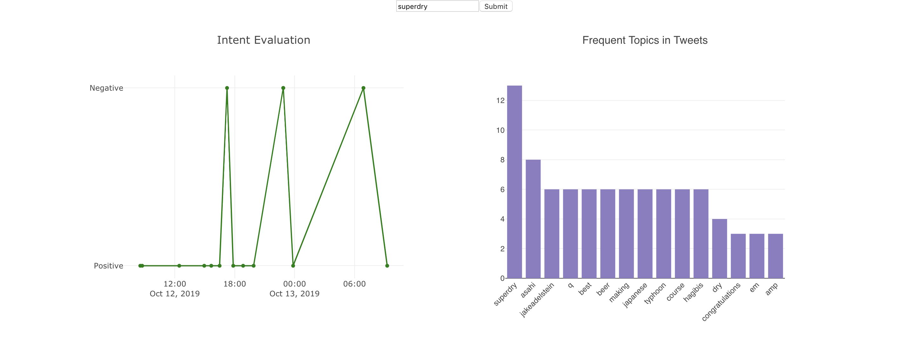

# Brand Evalautor
## About
Its a novel web application to built to evaluate the presence of a brand on twitter by checking the sentiments of the people's
tweets and topic on which they are talking about. This can help the brands to evaluate the performance of new lanuch of their new product. 

## check the app -  http://34.65.150.243/ 
It is deployed on google kubernetes cluster

## Technical Details
- Implemented Microservices architecture. It has four services each running as different docker container
  - Frontend 
  - Backend
  - Postgres
  - Pgadmin
- Frontend is built using create-react-pp
- Backend is built using FastApi. Here are some following features I implemented
    1. Both request and response are throughly validated.
    2. Project implements pydantic typing to type.
    3. Clean separation of environment variables.
    4. Results are saved in postgresDb
    
## Development && Deployment
- Fully Dockerized envoirment for both development and production.
- Docker compose is used in the development to orchestrate microservices.
- Kubernetes is used to deploy the microservices on google cloud platform
- App is available at - http://34.65.150.243/ 
- Backend swagger docs at - http://34.65.245.120/docs
